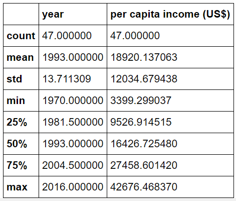
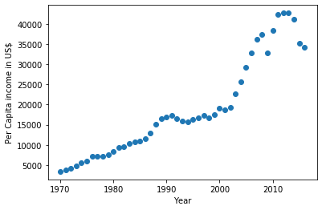
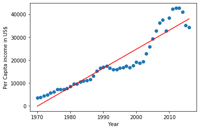

# Canada's per capita income prediction
An introduction towards Linear Regression machine learning model.
Linear regression is a type of machine learning algorithm that works on continuous data points.
It is one of the very basic forms of machine learning where we train a model to predict the behaviour of your data based on some variables. 
In the case of linear regression as you can see the name suggests linear that means the two variables which are on the x-axis and y-axis should be linearly correlated.
In this jupyter notebook, we have predicted per capita income of a person living in Canada.

# Features

This dataset contains 2 features-

* Per capita income of a citizen
* Year

# Visualization

With the help of Matplotlib library's scatter plot represention we can visualize the data

# Model building

From the above graphical representation we can see that there is a linear relationship between year and per capita income in that year.
Hence we employ Linear regression machine learning algorithm and determine following-

* Weights or coefficients
* Intercept

With these features we can determine best fit line that would align with the prediction.

